# Lab 01 : Implementing Data Loss Prevention at FinSecure SA

After a data incident exposed client financial 
records through an unsecured email channel, 
FinSecure SA had 30 days to implement technical 
controls preventing sensitive data from leaving 
the organization. This lab documents the design, 
implementation, and testing of those controls 
using Microsoft Purview DLP and Exchange mail 
flow rules including what worked, what failed, 
and what a determined insider can still bypass.

---

**Tools:** Microsoft Purview, Exchange Online

**Regulatory scope:** GDPR Articles 5, 25, 32, 33 
— ISO/IEC 27001 Annex A.8.12

**Lab environment:** Microsoft 365 Business 
Premium trial tenant

**Status:** Complete

---
A member of the security team flagged an unusual 
outbound email. A FinSecure SA employee had sent 
client documents containing personal and financial 
data to an external Gmail address — their own 
personal account.

Whether the action was accidental, careless, or 
intentional is beside the point. FinSecure SA 
operates a branch office in Paris, France, which 
means the company processes personal data of EU 
residents and falls under the jurisdiction of the 
General Data Protection Regulation (GDPR). Under 
GDPR Article 5(1)(f), personal data must be 
processed in a manner that ensures appropriate 
security, including protection against unauthorised 
or unlawful processing. Sending client records to 
a personal email address, regardless of intent, 
is a direct violation of that principle.

What made this incident particularly concerning 
was not the single occurrence but what it revealed. 
The incident was only discovered because a security 
solution happened to flag it. There was no DLP 
policy in place, no technical control to prevent 
or detect this kind of data movement. If it happened 
once without detection, it could have been happening 
across the Casablanca office, the Paris branch, or 
anywhere else in the organization for an unknown 
period of time.

The Data Protection Officer issued a formal 
requirement: implement technical controls within 
30 days that prevent sensitive client data from 
leaving the organization via email or cloud storage. 
The controls had to be proportionate, meaning they 
could not disrupt legitimate business operations, 
and they had to be documentable as evidence of 
compliance with GDPR Article 25 and ISO 27001 
Annex A.8.12.

This lab documents the design, implementation, 
and testing of those controls.

---

## Regulatory Requirements

The controls implemented in this lab address 
obligations under two frameworks: the General 
Data Protection Regulation (GDPR) and ISO/IEC 
27001:2022. Each article and control cited below 
directly informed a specific design decision in 
the implementation.

### GDPR Article 5(1)(f) : Integrity and Confidentiality

Personal data shall be processed in a manner 
that ensures appropriate security, including 
protection against unauthorised or unlawful 
processing and against accidental loss, 
destruction or damage, using appropriate 
technical or organisational measures.

This is the foundational requirement that makes 
the incident a regulatory concern rather than 
just an operational one. Transmitting client 
personal data to an unauthorised external address, 
regardless of intent, constitutes a failure to 
ensure appropriate security of processing. The 
DLP controls implemented in this lab are a direct 
technical response to this obligation.

### GDPR Article 25 : Data Protection by Design and by Default

The controller shall implement appropriate 
technical and organisational measures designed 
to implement data protection principles effectively 
and to integrate the necessary safeguards into 
the processing.

Article 25 requires that data protection is built 
into systems and processes from the beginning, not 
added as an afterthought. This article directly 
influenced the architectural decisions in this lab. 
Rather than implementing a single broad block on 
all external email, the policy was designed with 
proportionality in mind: different response tiers 
for different risk levels, preserving legitimate 
business operations while protecting personal data. 
The policy tip warning, the volume threshold, and 
the hard block on personal domains each reflect a 
deliberate design decision rooted in Article 25's 
proportionality requirement.

### GDPR Article 32 : Security of Processing

Taking into account the state of the art, the costs 
of implementation and the nature, scope, context 
and purposes of processing, the controller shall 
implement appropriate technical and organisational 
measures to ensure a level of security appropriate 
to the risk.

Article 32 requires organizations to implement 
technical measures appropriate to the risk, not 
perfect measures but proportionate ones. This 
article provides the rationale for the layered 
architecture implemented in this lab. A single 
control is insufficient. The combination of 
Exchange mail flow rules for recipient-based 
blocking and Microsoft Purview DLP for content 
inspection reflects the kind of layered technical 
approach Article 32 anticipates. The gaps 
identified in testing, including encrypted archive 
bypass and keyword evasion, are documented as 
residual risks that would require additional 
controls to address fully.

### GDPR Article 33 : Notification of a Personal Data Breach

In the case of a personal data breach, the 
controller shall without undue delay and, where 
feasible, not later than 72 hours after having 
become aware of it, notify the personal data 
breach to the supervisory authority.

Article 33 is relevant to this lab for two reasons. 
The original incident that triggered this 
implementation may itself have constituted a 
notifiable breach. Client personal data including 
IBANs and national ID numbers was transmitted to 
an unauthorised external address. Whether 
notification was required depends on the assessed 
risk to data subjects, a determination that requires 
both technical and legal analysis. Beyond that, the 
DLP controls implemented here create the incident 
logging and audit trail that Article 33 compliance 
depends on. Without documented evidence of what 
data was involved, when it moved, and who was 
affected, meeting the 72-hour notification 
requirement becomes significantly harder.

### ISO/IEC 27001:2022 Annex A.8.12 : Data Leakage Prevention

Data leakage prevention measures shall be applied 
to systems, networks and any other devices that 
process, store or transmit sensitive information.

Annex A.8.12 provides the information security 
management framework requirement that complements 
the GDPR obligations above. Where GDPR Article 
5(1)(f) establishes the legal obligation to protect 
personal data, ISO 27001 Annex A.8.12 establishes 
the operational security control required to meet 
that obligation. The DLP policy implemented in this 
lab, covering email, SharePoint, and OneDrive, 
directly addresses this control across the primary 
data movement channels available to FinSecure SA 
employees.

It is worth noting that technical controls alone 
do not constitute full compliance with either GDPR 
or ISO 27001. Both frameworks require complementary 
organisational measures including policies, training, 
procedures, and governance that sit outside the 
scope of this technical lab. The controls documented 
here contribute to compliance but do not replace 
the broader programme of organisational measures 
required.

---

## Design Decisions

### What are Sensitive Information Types and why did we build custom ones?

Sensitive Information Types (SITs) are essentially 
the patterns and clues we give Microsoft Purview 
to recognize specific categories of sensitive data. 
Purview scans content looking for matches against 
these patterns and triggers policy actions when 
it finds them.

Purview comes with a large built-in library covering 
common data types across many countries. The problem 
is none of those built-in types covered the two data 
formats most critical to FinSecure SA: Moroccan 
national ID numbers (CIN) and Moroccan IBANs. Without 
custom SITs for these formats, the DLP policy would 
catch a French IBAN but completely miss a Moroccan 
one in the same email. That gap was the first thing 
that needed fixing.

Two custom SITs were created using regex patterns 
based on the official formats of each data type. 
Testing later revealed that the CIN pattern was too 
broad and generated false positives, which is covered 
in the Unexpected Findings section.

### Why two tools instead of one?

A reasonable question is why we used both an Exchange 
mail flow rule and a Microsoft Purview DLP policy 
rather than handling everything in one place.

Each tool operates at a different layer and does 
something the other cannot.

Exchange mail flow rules work at the routing layer. 
They evaluate who is sending the email and where 
it is going before it is delivered. They are fast 
and precise for recipient-based decisions but cannot 
inspect the actual content of an email against SIT 
patterns. For blocking emails to personal domains 
like Gmail or Hotmail, a mail flow rule is the 
right tool for the job.

Microsoft Purview DLP works at the content inspection 
layer. It scans the body and attachments of emails 
against SIT patterns and triggers actions based on 
what it finds inside. It cannot make routing decisions 
based purely on the recipient domain the way a mail 
flow rule can.

Using both together means each layer handles what 
it does best. The mail flow rule handles 
recipient-based blocking. The DLP policy handles 
content-based detection. Neither tool alone would 
have been sufficient.

### Why three tiers of response?

The simplest approach would have been a single rule 
blocking all external emails containing sensitive 
data. Straightforward to configure and maximally 
restrictive.

It would also break how the business operates.

FinSecure SA sends client account statements 
externally. Relationship managers share individual 
client records with authorized partners. The Paris 
office submits data to French regulatory bodies. 
A blanket block would stop all of these alongside 
the actual risks, pushing employees toward 
workarounds that make the organization less 
secure in the long run.

GDPR Article 25 requires controls to be 
proportionate to the risk, not maximally 
restrictive. Three different risk scenarios 
were identified, each warranting a different 
response.

Emails going to personal domains like Gmail 
or Hotmail have no legitimate business 
justification when they contain client financial 
data. This is exactly the scenario that triggered 
the original incident. Hard block, no override.

Emails containing large volumes of client records 
going externally represent a meaningfully higher 
exfiltration risk than a single client statement. 
These are blocked with a logged override option 
requiring a business justification.

Emails containing a single client record going 
to a business domain are a routine part of 
operations. Blocking these would create more 
friction than security value. A policy tip 
warning the user and logging the incident 
to the administrator strikes the right balance.

It is worth noting that the mail flow rule 
requires both conditions to be met simultaneously: 
the email must be going to a personal domain 
AND contain sensitive content. This means 
legitimate emails to personal domains that 
contain no sensitive data pass through freely 
without requiring explicit exceptions. The 
specificity of the conditions builds 
proportionality directly into the rule logic.

### The value of incident reports

Both the volume block and the warn rule send 
incident reports to the security administrator 
whether the email was blocked or allowed through. 
This is intentional.

Over time these reports give the administrator 
visibility into how employees are handling 
sensitive data across the organization. Repeated 
warnings from a specific department, a user 
consistently triggering the volume threshold, 
unusual patterns in external sharing activity 
all become visible. That data allows the 
administrator to calibrate and refine the 
policies based on what is actually happening 
rather than assumptions made on day one.

A DLP policy is not a set-and-forget control. 
It needs ongoing tuning. The incident reports 
are what make that tuning possible.

### Sensitivity labels

Sensitivity labels can be applied to documents 
manually or automatically through auto-labeling 
policies using the same SITs configured in the 
DLP policy. When a label is applied it can 
encrypt the document and restrict who can open 
it, meaning even if the file reaches the wrong 
hands the recipient cannot access the content 
without authorization.

This makes sensitivity labels a strong complement 
to DLP rather than a replacement for it. DLP 
controls data in motion. Sensitivity labels 
protect the document itself regardless of where 
it ends up. Together they cover more ground 
than either one alone.

Sensitivity labels are out of scope for this 
lab. The focus here is on email and cloud 
storage exfiltration channels which DLP 
addresses directly. Label implementation 
will be covered in a future lab in this series.

### A note on proportionality

Proportionality under GDPR is not a fixed 
standard that applies equally to every 
organization. It depends on the specific 
context, the nature of the data being 
processed, the size of the organization, 
and the realistic threat landscape it faces.

What is proportionate for FinSecure SA, a 
financial services firm processing Moroccan 
and French client data across two jurisdictions, 
will be different from what is proportionate 
for a small marketing agency or a hospital. 
The decisions documented here reflect 
FinSecure SA's specific context and should 
not be copied directly into another 
organization's implementation without 
a fresh proportionality assessment.

---

## Technical Implementation

### Environment

The lab was built on a Microsoft 365 Business 
Premium trial tenant. This license tier includes 
Microsoft Purview Data Loss Prevention, Exchange 
Online, SharePoint Online, and OneDrive for 
Business, covering the primary data movement 
channels relevant to this scenario.

Five fictional users were created representing 
FinSecure SA employees across different 
departments and locations:

| User | Role | Department |
|---|---|---|
| Ahmed Benali | Junior Analyst | Finance, Casablanca |
| Marie Laurent | Finance Manager | Finance, Casablanca |
| Sophie Mercier | Compliance Officer | Compliance, Paris |
| Karim Idrissi | IT Administrator | IT, Casablanca |
| Yasmine Tazi | HR Manager | HR, Casablanca |

Ahmed Benali was used as the primary test user 
throughout, representing the employee involved 
in the original incident.

### Custom Sensitive Information Types

Two custom Sensitive Information Types were 
created in Microsoft Purview to detect Moroccan 
client data formats not covered by the built-in 
library.

**Moroccan National ID (CIN)**

The Carte d'Identité Nationale follows a specific 
format: one or two uppercase letters followed by 
exactly six digits.

Regex pattern: `\b[A-Z]{1,2}[0-9]{6}\b`

Examples: A123456, AB654321

The pattern was tested in Purview using sample 
CIN values and confirmed detection before being 
used in the DLP policy.

**Moroccan IBAN**

Moroccan IBANs begin with the country code MA 
followed by two check digits and 24 alphanumeric 
characters, giving a total length of 28 characters.

Regex pattern: `\bMA[0-9]{2}[A-Z0-9]{24}\b`

Example: MA64011519000001205000534921

The pattern was tested against sample values and 
confirmed accurate detection.

Both SITs were validated using Purview's built-in 
test function before being referenced in any policy. 
Screenshots of the test results are included below.

### Exchange Mail Flow Rule

An Exchange mail flow rule was configured to handle 
the recipient-based blocking layer of the architecture.

**Rule name:** Block - Client Data to Personal Email Domains

**Conditions:**
- Recipient domain belongs to any of: gmail.com, 
  hotmail.com, yahoo.com, outlook.com, icloud.com, 
  yahoo.fr, hotmail.fr
- Subject or body includes any of: IBAN, CIN, 
  account number, numéro de compte

Both conditions must be met simultaneously for the 
rule to trigger. An email going to Gmail that 
contains no sensitive data passes through freely. 
An email containing sensitive data going to a 
business domain is handled by the DLP policy 
rather than this rule.

**Action:** Reject the message with the explanation: 
"FinSecure SA security policy prohibits sending 
client financial or identity data to personal email 
addresses. If you believe this is an error contact 
your IT security team."

**Priority:** 0, evaluated before all other mail 
flow rules.

**Mode:** Enforce, active immediately upon saving.

### Microsoft Purview DLP Policy

A DLP policy was created in Microsoft Purview 
covering Exchange email, SharePoint sites, and 
OneDrive accounts.

**Policy name:** FinSecure SA - Client Data Protection Policy

**Locations:** Exchange email, SharePoint sites, 
OneDrive accounts

Two rules were configured within the policy, 
evaluated in order of priority.

**Rule 1 - Volume Block**

Name: Block - High Volume Client Data Sharing

Purpose: Prevents bulk exfiltration of client 
records by blocking emails containing five or 
more instances of sensitive data going externally.

Conditions:
- Content contains Moroccan IBAN or Moroccan CIN
- Minimum instance count: 5
- Content shared outside the organization

Action: Block the email

User notification: Policy tip informing the user 
the email has been blocked and to contact their 
manager if the send is legitimate.

Incident report: High severity alert sent to the 
security administrator.

Override: Business justification required, the 
user must provide a written reason. This is a 
compensating control available due to license 
limitations. A full manager approval workflow 
would be available in a Microsoft 365 E5 
environment.

**Rule 2 - Warn and Log**

Name: Warn - External Sharing of Client Data

Purpose: Creates visibility over all external 
sharing of sensitive client data without blocking 
legitimate business operations.

Conditions:
- Content contains Moroccan IBAN or Moroccan CIN
- Minimum instance count: 1
- Content shared outside the organization

Action: None, the email is not blocked.

User notification: Policy tip asking the user to 
confirm the send is intentional and the recipient 
is authorized.

Incident report: Medium severity alert sent to 
the security administrator.

Override: Allowed. The user can proceed after 
acknowledging the policy tip. The override is 
logged and included in the incident report.

**Rule priority note:** Rule 1 sits above Rule 2 
in the policy. An email containing five or more 
sensitive records triggers the block rule rather 
than the warn rule. During testing both rules 
fired simultaneously on Test 3 because the email 
met both thresholds. This is documented in the 
Unexpected Findings section.

### A note on policy propagation

After the DLP policy was created the status 
showed as syncing. Full propagation across the 
tenant took longer than the commonly cited 
30-minute estimate. In a new trial tenant without 
established configuration, propagation can take 
several hours. The mail flow rule by contrast 
took effect immediately upon saving.

In a production environment this propagation 
delay must be factored into incident response 
planning. A newly created or modified DLP policy 
cannot be relied upon for immediate enforcement 
and should be tested after sufficient propagation 
time before being considered active.

### Screenshots

The following screenshots document the 
implementation and are referenced throughout 
the Testing Results section.

1. Custom SIT - Moroccan CIN detection test result
2. Custom SIT - Moroccan IBAN detection test result
3. Exchange mail flow rule configuration
4. DLP policy - Rule 1 volume block configuration
5. DLP policy - Rule 2 warn rule configuration
6. Test 1 - rejection message received by Ahmed Benali
7. Test 2 - policy tip warning in Outlook
8. Test 3 - block notification with override option
9. Test 3 - admin incident report emails (warn and block)
10. Test 5a - policy tip for unencrypted ZIP attachment
11. Test 5b - encrypted ZIP delivered with no detection

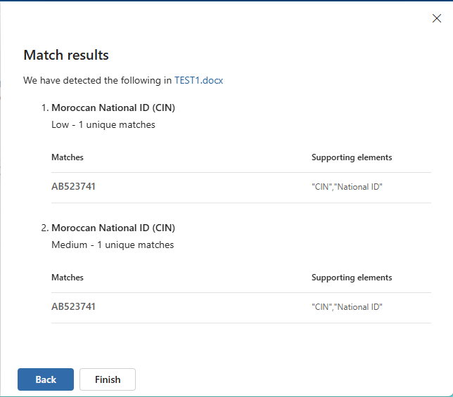
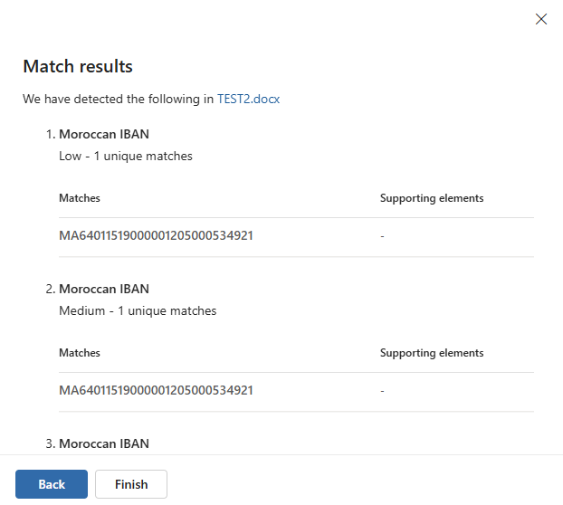
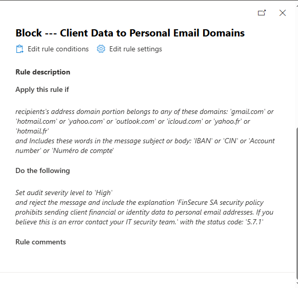
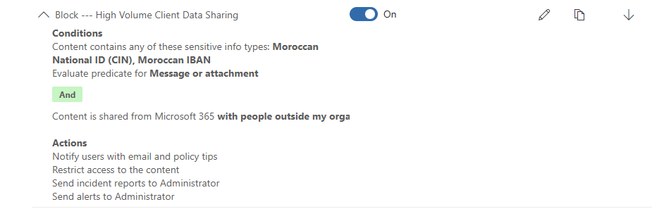
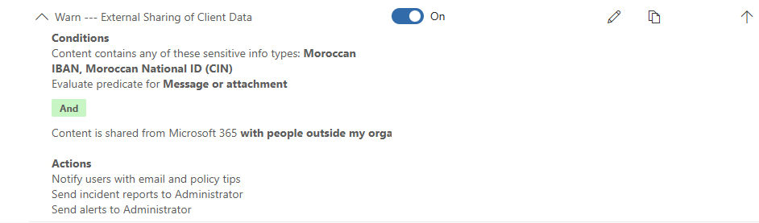
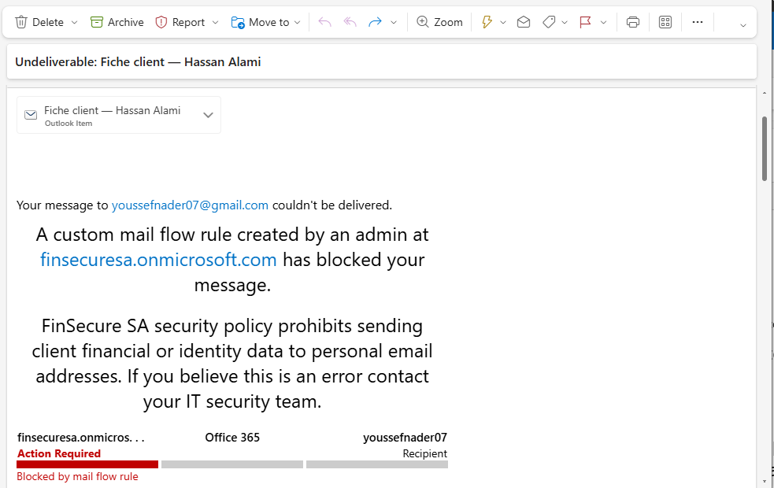
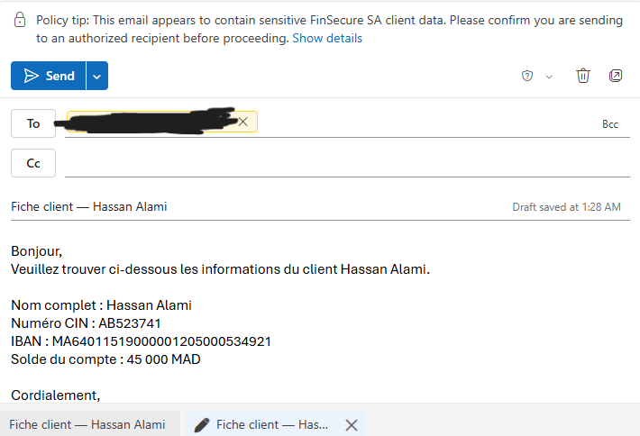
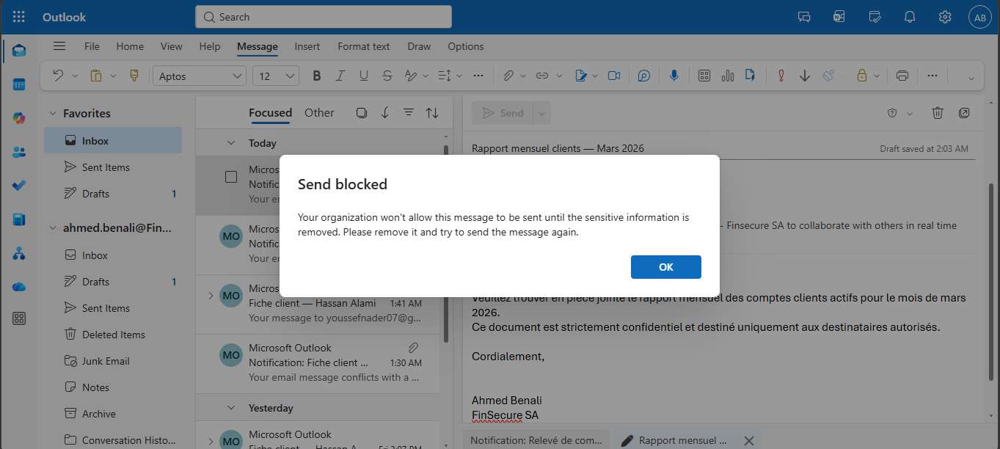
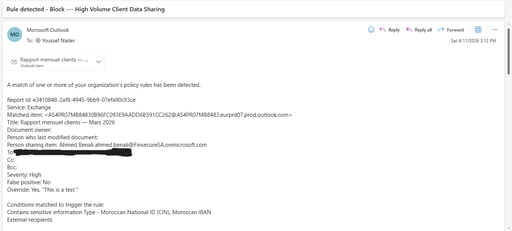
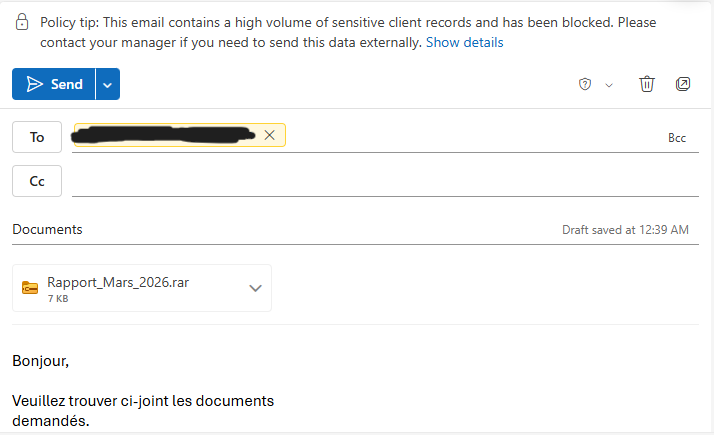
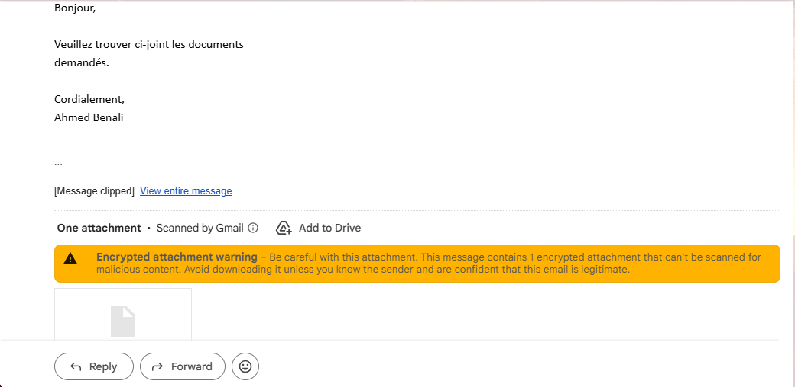

---

## Testing Results

Six tests were conducted to validate the 
implemented controls across different scenarios. 
Tests were designed to cover both expected 
behavior and deliberate bypass attempts. 
Results are documented honestly including 
failures and unexpected behavior.

## Testing Results

Six tests were conducted to validate the implemented 
controls across different scenarios. Tests covered 
both expected behavior and deliberate bypass attempts. 
Results are documented honestly including failures 
and unexpected behavior.

### Testing Methodology

Tests were conducted using two browser sessions 
simultaneously. Ahmed Benali's account was used as 
the sending user in a private browser window logged 
into Outlook on the web. The administrator account 
monitored Purview alerts and the admin mailbox in 
a separate session.

All sensitive data used in testing is fictional. 
CIN numbers and IBANs used do not correspond to 
real individuals or accounts.

### Test 1 - Mail Flow Rule: Hard Block on Personal Domain

**Objective:** Verify the Exchange mail flow rule 
blocks emails containing sensitive client data sent 
to personal email domains.

**Data sent:** Single Moroccan IBAN and CIN number 
in email body in a realistic client file format.

**Destination:** Personal Gmail address.

**Expected result:** Email rejected at the Microsoft 
level before reaching Gmail. Ahmed receives a 
rejection notification with the configured 
explanation message.

**Actual result:** Pass, after an initial 
configuration issue was identified and resolved.

During the first attempt the email was not blocked 
by the mail flow rule and reached Gmail's servers 
where it was rejected as spam by Google. 
Investigation revealed the rule had three conditions 
connected with AND, including an attachment condition 
that was never met for plain text emails. The 
redundant attachment condition was removed, leaving 
two conditions: recipient domain and body content. 
On retest the rule fired correctly and the email 
was rejected at the Microsoft level.

Ahmed received the rejection notification: 
"FinSecure SA security policy prohibits sending 
client financial or identity data to personal email 
addresses. If you believe this is an error contact 
your IT security team."

The email did not reach Gmail.

### Test 2 - DLP Warn Rule: Single Record to Business Domain

**Objective:** Verify the DLP warn rule triggers a 
policy tip and logs an incident when a single 
sensitive record is sent to an external business domain.

**Data sent:** Single Moroccan IBAN in email body 
formatted as a client account statement.

**Destination:** External non-Gmail business email address.

**Expected result:** Policy tip warning appears before 
sending. Email goes through. Admin receives incident report.

**Actual result:** Pass, with one configuration issue 
identified and resolved.

The policy tip appeared before Ahmed sent the email, 
prompting confirmation that the send was intentional. 
The email went through successfully after acknowledgment.

The admin did not initially receive an incident report. 
Investigation revealed the incident report recipient 
was set to the default placeholder "SiteAdmin" rather 
than an actual email address. After replacing the 
placeholder with the administrator's real email address 
the incident report was received correctly on retest.

The incident report confirmed detection of Moroccan 
IBAN in the email content.

### Test 3 - DLP Volume Block: Bulk Client Data in Excel Attachment

**Objective:** Verify the volume block rule triggers 
when an email contains five or more instances of 
sensitive client data, including data inside an 
Excel attachment.

**Data sent:** Excel spreadsheet containing six client 
records, each with a full name, CIN number, IBAN, and 
account balance. The email body contained no sensitive 
data, only a brief covering message in French.

**Destination:** External non-Gmail business email address.

**Expected result:** Email blocked. Admin notified 
via incident report.

**Actual result:** Pass, with an additional finding 
on rule interaction.

The email was blocked and Ahmed received the block 
notification. Purview successfully inspected the 
content inside the Excel attachment and detected 
the sensitive data without it being present in the 
email body. This confirms that Purview's content 
inspection reaches inside common attachment formats.

The admin received two incident report emails rather 
than one. Both the volume block rule and the warn 
rule fired simultaneously because the attachment met 
both thresholds: more than one sensitive record 
triggering the warn rule, and more than five 
triggering the volume block. In a production 
environment rule prioritization would be configured 
to ensure only the most restrictive rule fires, 
preventing duplicate notifications. This is noted 
as a configuration refinement for production deployment.

The override option was available but required a 
business justification to proceed. Due to Business 
Premium license limitations a full manager approval 
workflow was not available. Business justification 
logging serves as a compensating control.

### Test 4 - Bypass Attempt: Keyword Evasion and Format Modification

**Objective:** Assess whether controls can be bypassed 
by a technically aware user using alternative 
terminology and modified data formats.

**Data sent:** Single Moroccan IBAN with dashes inserted 
to break the regex pattern and a Moroccan CIN number. 
Sensitive data was described using alternative 
terminology: "Référence bancaire" instead of IBAN 
and "Pièce d'identité" instead of CIN.

**Destination:** Personal Gmail address.

**Expected result:** Unknown, bypass assessment.

**Actual result:** Partial. Two bypass vectors 
confirmed, one unexpected detection.

The mail flow rule did not block the email. The 
alternative keywords "Référence bancaire" and 
"Pièce d'identité" are not in the rule's keyword 
list, so the content condition was not met. The 
email was not blocked at the routing layer.

The modified IBAN format with dashes broke the 
regex pattern as expected. Purview did not detect 
the IBAN.

However a DLP policy tip appeared and Ahmed received 
a policy conflict notification. The notification 
confirmed that Purview had detected the Moroccan CIN, 
not the IBAN. The CIN regex pattern is simpler and 
dashes do not appear in the format, so the pattern 
matched successfully despite the bypass attempt.

This led to an important finding: the CIN regex 
pattern is too broad. The pattern [A-Z]{1,2}[0-9]{6} 
matches any combination of one or two uppercase 
letters followed by six digits, a structure that 
appears in many legitimate contexts including 
reference numbers, invoice codes, and product 
identifiers. In a production environment this false 
positive rate would generate alert fatigue, causing 
security teams to dismiss genuine alerts alongside 
false ones.

The recommended fix is to add supporting keyword 
elements to the CIN sensitive information type, 
requiring context words such as CIN, Carte 
d'identité, or pièce d'identité to appear within 
300 characters of the pattern match before the SIT 
triggers at high confidence. This would significantly 
reduce false positives while maintaining accurate 
detection of genuine CIN numbers.

### Test 5a - Bypass Attempt: Unencrypted ZIP Attachment

**Objective:** Assess whether Purview can inspect 
content inside a compressed ZIP archive.

**Data sent:** The same Excel spreadsheet from Test 3 
compressed into an unencrypted ZIP file. The email 
body contained no sensitive data.

**Destination:** Personal Gmail address.

**Expected result:** Unknown, content inspection 
capability assessment.

**Actual result:** Pass. Purview inspected inside the ZIP.

A DLP policy tip appeared before sending, confirming 
that Purview's content inspection reached inside the 
unencrypted ZIP archive and detected the sensitive 
data. The mail flow rule did not block the email as 
the email body contained no keywords, but the DLP 
policy provided a compensating layer of detection.

This is a stronger result than expected for the 
Business Premium license tier and confirms that 
unencrypted archive files do not represent a 
reliable bypass vector against Purview DLP.

### Test 5b - Bypass Attempt: Encrypted ZIP Attachment

**Objective:** Assess whether an encrypted archive 
bypasses content inspection entirely.

**Data sent:** The same Excel spreadsheet compressed 
into a password-protected ZIP archive using 7-Zip. 
The email body contained no sensitive data.

**Destination:** Personal Gmail address.

**Expected result:** Complete bypass. Encrypted 
content cannot be inspected.

**Actual result:** Complete bypass confirmed.

No policy tip appeared. No mail flow rule triggered. 
No admin notification was generated. The email was 
delivered to Gmail successfully with no detection 
at any layer.

This is the most significant gap identified in 
testing. An insider with basic technical knowledge 
can bypass the entire implemented control set by 
simply compressing sensitive data into a 
password-protected archive before sending. The 
controls implemented in this lab provide no 
protection against this specific exfiltration 
technique.

Addressing this gap requires controls operating 
at the endpoint level rather than the content 
inspection level, specifically endpoint DLP 
policies that restrict the creation or uploading 
of encrypted archives containing sensitive data. 
This is addressed in Lab 02 of this series.

### Testing Summary

| Test | Scenario | Result |
|---|---|---|
| Test 1 | Mail flow rule - personal domain block | Pass (after config fix) |
| Test 2 | DLP warn rule - single record external | Pass (after config fix) |
| Test 3 | DLP volume block - bulk Excel attachment | Pass (dual notification noted) |
| Test 4 | Bypass - keyword evasion and format modification | Partial - CIN false positive identified |
| Test 5a | Bypass - unencrypted ZIP | Pass - Purview inspects ZIP contents |
| Test 5b | Bypass - encrypted ZIP | Fail - complete bypass confirmed |

Two configuration issues were identified and resolved 
during testing. Two bypass vectors were confirmed. 
One false positive issue was identified in the CIN 
sensitive information type. One unexpected capability 
was confirmed: Purview inspects unencrypted ZIP archives.

All findings are documented in the Unexpected Findings 
and Gaps and Limitations sections that follow.

---

### Testing Summary

| Test | Scenario | Result |
|---|---|---|
| Test 1 | Mail flow rule — personal domain block | Pass (after config fix) |
| Test 2 | DLP warn rule — single record external | Pass (after config fix) |
| Test 3 | DLP volume block — bulk Excel attachment | Pass (dual notification noted) |
| Test 4 | Bypass — keyword evasion and format modification | Partial — CIN false positive identified |
| Test 5a | Bypass — unencrypted ZIP | Pass — Purview inspects ZIP contents |
| Test 5b | Bypass — encrypted ZIP | Fail — complete bypass confirmed |

Two configuration issues were identified and 
resolved during testing. Two bypass vectors 
were confirmed. One false positive issue was 
identified in the CIN sensitive information 
type. One unexpected capability was confirmed 
— Purview inspects unencrypted ZIP archives.

All findings are documented in the Unexpected 
Findings and Gaps and Limitations sections 
that follow.

---

## Unexpected Findings

This section documents behavior that differed 
from what was expected during testing. These 
findings are as valuable as the tests that 
passed. They reflect the reality that security 
controls rarely behave exactly as configured 
on the first attempt.

### Finding 1 - Mail Flow Rule: Redundant Attachment Condition Caused Silent Failure

During Test 1 the Exchange mail flow rule failed 
to block an email containing sensitive client data 
sent to a personal Gmail address. The email reached 
Gmail's servers where it was rejected as spam by 
Google rather than being blocked by Microsoft.

Investigation revealed the rule had three conditions 
connected with AND:
- Recipient domain is personal
- Subject or body includes keywords
- Attachment includes keywords

All three conditions had to be satisfied 
simultaneously. Since the test email had no 
attachment the third condition was never met 
and the rule never fired.

The fix was straightforward: remove the attachment 
condition entirely. Attachment content inspection 
is handled by the DLP policy. The mail flow rule's 
responsibility is recipient-based blocking combined 
with body content detection, not attachment inspection.

The more important observation is about how this 
failure presented. The email was not blocked by 
Microsoft. It reached an external server. From 
Ahmed's perspective the email appeared to send 
normally with no error, no notification, no 
indication that anything was wrong. If this had 
been a real incident rather than a test the 
failure would have been invisible.

This highlights a critical principle in security 
control validation: absence of an error is not 
evidence that a control is working. Every control 
must be explicitly tested to confirm it fires 
under the conditions it was designed for.

### Finding 2 - DLP Incident Reports: Default Placeholder Not Replaced

During Test 2 the security administrator did not 
receive an incident report email despite the DLP 
warn rule firing correctly and generating a policy 
tip for the user.

Investigation revealed the incident report recipient 
was configured as the default placeholder value 
"SiteAdmin" rather than an actual administrator 
email address. The incident was being generated 
internally but the notification was going nowhere.

This is a configuration error that would be easy 
to overlook in a production deployment. The DLP 
policy appears to be working from the user's 
perspective, the policy tip fires and the user is 
warned, but the security team receives no visibility 
over what is happening. The monitoring function of 
the policy is silently broken.

After replacing the placeholder with the 
administrator's real email address incident reports 
were received correctly for all subsequent tests.

In a production environment verifying notification 
recipients should be a standard step in DLP policy 
deployment checklists. Sending a deliberate test 
email immediately after policy deployment and 
confirming the admin notification arrives is a 
simple validation that should not be skipped.

### Finding 3 - Dual Rule Triggering on Test 3

During Test 3 the administrator received two 
incident report emails, one from the warn rule 
and one from the volume block rule, for the 
same email.

The Excel attachment contained six client records. 
This satisfied both the minimum instance count of 
one required by the warn rule and the minimum count 
of five required by the volume block rule. Both 
rules fired simultaneously.

From a detection standpoint this is correct behavior, 
the email genuinely met both thresholds. From an 
operational standpoint it creates noise. In a 
production environment receiving duplicate 
notifications for the same email would contribute 
to alert fatigue over time.

The fix is to configure rule priority so that when 
the volume block fires the warn rule is suppressed. 
Microsoft Purview allows this through the "stop 
processing more rules" option on the volume block 
rule. When enabled Purview evaluates rules in 
priority order and stops at the first match, 
preventing lower priority rules from firing on 
the same content.

This was identified as a configuration refinement 
for production deployment rather than a critical 
failure of the current implementation.

### Finding 4 - CIN Regex Pattern: False Positive Risk

During Test 4 the Moroccan CIN sensitive information 
type detected content that was not a genuine CIN 
number. The regex pattern [A-Z]{1,2}[0-9]{6} is 
broad enough to match any combination of one or 
two uppercase letters followed by six digits, a 
structure that appears in many legitimate business 
contexts including reference numbers, invoice codes, 
and internal identifiers.

In a small test environment with five users this 
false positive rate is manageable. In a real 
organization with hundreds of employees sending 
thousands of emails daily the same pattern would 
generate a significant volume of false positive 
alerts. Security teams that receive too many false 
positives begin dismissing alerts without careful 
review, a phenomenon known as alert fatigue that 
can cause genuine incidents to be missed.

The recommended fix is to add supporting keyword 
elements to the CIN sensitive information type. 
By requiring context words such as CIN, Carte 
d'identité, identité nationale, or pièce d'identité 
to appear within 300 characters of the pattern 
match, the SIT would only trigger when the data 
appears in a context consistent with a genuine 
identity document reference. This would 
significantly reduce false positives while 
maintaining detection accuracy for real CIN numbers.

This finding illustrates a broader principle: a 
sensitive information type that generates excessive 
false positives is operationally worse than one 
that is slightly less sensitive. Detection accuracy 
and operational practicality must be balanced during 
SIT design, and that balance can only be assessed 
through realistic testing with representative content.

### Finding 5 - Policy Propagation Delay

After the DLP policy was created and set to active 
the Purview overview dashboard showed no policies 
for an extended period. The policy status showed 
as syncing rather than active.

In a new Microsoft 365 trial tenant without 
established configuration, DLP policy propagation 
can take significantly longer than the commonly 
referenced 30-minute estimate. Testing conducted 
before full propagation produced inconsistent 
results that could have been misinterpreted as 
policy failures.

In a production environment policy changes should 
be validated after sufficient propagation time. 
A newly deployed or modified DLP policy should 
not be considered active for enforcement purposes 
until propagation is confirmed through explicit 
testing. This is particularly important in incident 
response scenarios where a DLP policy change might 
be deployed in response to an active threat. 
Assuming the change takes effect immediately could 
leave a gap in protection during the propagation 
window.

---

## Gaps and Limitations

No security control is complete. This section 
documents what the implemented controls do not 
protect against, why those gaps exist, and what 
additional controls would be needed to address 
them in a production environment.

Understanding the boundaries of a control is as 
important as understanding what it does. A security 
team that believes their DLP policy covers everything 
is more dangerous than one that knows exactly where 
the gaps are.

### Gap 1 - Encrypted Archive Bypass

The most significant gap identified during testing. 
A password-protected archive created with 7-Zip 
containing sensitive client data was sent to a 
personal Gmail address without triggering any 
control. No policy tip, no mail flow rule block, 
no admin notification. The email was delivered 
successfully.

Microsoft Purview content inspection cannot decrypt 
password-protected archives. When it encounters 
encrypted content it sees ciphertext, not data. 
There is nothing to inspect.

This is not a Purview limitation specifically. It 
is a fundamental constraint of any content 
inspection-based DLP approach. Content inspection 
requires readable content. Encryption removes 
readability by design.

Addressing this gap requires moving the control 
to the endpoint layer rather than the content 
inspection layer. Microsoft Purview Endpoint DLP 
can restrict the ability to create encrypted 
archives containing sensitive data, upload files 
to personal cloud storage, or copy files to 
removable media regardless of whether the content 
is encrypted. The control operates on the action 
rather than the content. Endpoint DLP is addressed 
in Lab 02 of this series.

### Gap 2 - Keyword Evasion on Mail Flow Rule

The Exchange mail flow rule relies on specific 
keyword matching to identify emails containing 
sensitive content. An employee who replaces 
trigger keywords with synonyms or alternative 
descriptions can bypass the rule entirely.

During testing "Référence bancaire" instead of 
IBAN and "Pièce d'identité" instead of CIN 
successfully bypassed the keyword condition. 
The mail flow rule did not fire.

This is a fundamental limitation of keyword-based 
detection. Keywords can always be replaced. A 
comprehensive keyword list reduces the risk but 
cannot eliminate it, and an overly broad keyword 
list generates false positives that undermine 
operational efficiency.

The DLP policy provides a partial compensating 
control here. Unlike the mail flow rule which 
relies on keywords, the DLP policy uses regex-based 
SIT patterns that detect the data format itself 
rather than the words used to describe it. An 
employee who replaces IBAN with Référence bancaire 
but leaves the actual IBAN number in the email 
will still be detected by the DLP policy.

The gap that remains is the combination of keyword 
evasion and format modification simultaneously. 
This combination bypassed all controls in Test 4. 
Addressing it fully requires machine learning based 
classifiers that detect context and meaning rather 
than patterns, a capability available in Microsoft 
Purview through trainable classifiers which require 
sufficient training data and a higher license tier 
to implement effectively.

### Gap 3 - Non-Email Exfiltration Channels

The controls implemented in this lab focus on 
email as the primary exfiltration channel. This 
was appropriate given that the original incident 
involved email. However email is one of many 
channels through which sensitive data can leave 
an organization.

Channels not covered by this implementation:

**USB and removable media:** An employee can copy 
sensitive files to a USB drive and walk out of 
the office. No email involved, no content 
inspection triggered.

**Personal cloud storage:** An employee can upload 
files directly to a personal Google Drive, Dropbox, 
or iCloud account through a browser without sending 
an email. The DLP policy covers OneDrive and 
SharePoint but not personal cloud storage accessed 
through a browser.

**Screenshots and photographs:** An employee can 
take a screenshot of sensitive data on screen or 
photograph their monitor with a mobile phone. 
No digital control can prevent this.

**Printing:** Sensitive documents can be printed 
and physically removed. The digital controls 
implemented here have no visibility over physical 
documents.

These channels are addressed progressively through 
endpoint DLP in Lab 02 and behavioral analytics 
in later labs. They are noted here to make clear 
that email DLP alone is not a complete data 
protection program.

---

### Gap 4 — License Tier Limitations

The implementation was built on a Microsoft 
365 Business Premium trial tenant. Several 
capabilities that would strengthen the 
controls in a production environment 
require a higher license tier.

**Manager approval workflows:** The volume 
block rule could not be configured with 
a full manager approval workflow requiring 
explicit sign-off before an override is 
permitted. Business Premium supports 
business justification logging as a 
compensating control but not the 
structured approval workflow available 
in Microsoft 365 E5.

**Advanced classification:** Trainable 
classifiers that detect sensitive content 
based on meaning and context rather than 
patterns require Microsoft 365 E5. These 
would address the keyword evasion gap 
documented above more effectively than 
regex-based SITs.

**Insider Risk Management:** Full Microsoft 
Purview Insider Risk Management capabilities 
including behavioral scoring and adaptive 
protection require E5. This is addressed 
in Lab 02.

These limitations do not invalidate the 
controls implemented here. They represent 
the realistic ceiling of what Business 
Premium provides and serve as a reference 
for what a production E5 deployment 
would add.

---

### Gap 5 — New and Unverified Tenant Behavior

During testing several emails sent to 
external addresses were rejected by 
recipient mail servers as spam. This 
occurred because the trial tenant had 
not established sender reputation — 
new domains without SPF, DKIM, and 
DMARC configuration are treated with 
suspicion by external mail servers.

In a production environment with a 
verified domain and proper email 
authentication configuration this 
rejection would not occur. Emails 
that bypassed Microsoft's controls 
would reach the recipient's inbox 
rather than being caught by the 
recipient's spam filter.

This is noted because the spam 
rejection created a false impression 
during some tests that the controls 
were working when they were not. 
The email was stopped — but by 
Google's spam filter, not by 
FinSecure SA's DLP controls. 
In a production environment that 
safety net would not exist.

---

### Summary of Gaps

| Gap | Severity | Compensating Control | Addressed In |
|---|---|---|---|
| Encrypted archive bypass | Critical | None in this lab | Lab 02 — Endpoint DLP |
| Keyword evasion | High | DLP SIT pattern detection (partial) | Future lab — trainable classifiers |
| Non-email exfiltration channels | High | None in this lab | Lab 02 — Endpoint DLP |
| License tier limitations | Medium | Compensating controls documented | N/A — production E5 deployment |
| Unverified tenant behavior | Low | N/A in production | N/A — production deployment |

---

## The Fundamental Reality of DLP

Testing revealed that a technically aware insider 
determined to exfiltrate data can bypass the 
controls implemented in this lab. An encrypted 
archive bypassed content inspection entirely. 
Keyword evasion bypassed the mail flow rule. 
Format modification reduced detection accuracy.

A reasonable question follows: if a determined 
insider can bypass DLP controls, what is the 
point of implementing them at all?

The answer requires understanding what DLP is 
designed to do and what it is not.

### What DLP is not

DLP is not a guarantee against data exfiltration. 
No technical control is. A sufficiently motivated 
insider with technical knowledge, physical access, 
and time will find a way to remove data from an 
organization regardless of the controls in place. 
This is an uncomfortable truth that security 
professionals must accept.

DLP is not a replacement for trust, culture, and 
human judgment. An organization that relies entirely 
on technical controls to prevent insider threats 
has misunderstood the problem.

### What DLP actually does

**It eliminates accidental exfiltration.**
The incident that triggered this lab, a junior 
analyst emailing 47 client records to his personal 
Gmail, was not malicious. It was careless. The vast 
majority of data loss incidents are exactly this: 
well-intentioned employees making mistakes under 
time pressure. DLP stops these incidents before 
they become breaches. This alone justifies the 
investment.

**It raises the cost of intentional exfiltration.**
A determined insider can bypass DLP controls but 
doing so requires technical knowledge, deliberate 
effort, and conscious decision-making. Every 
additional step between intent and action is an 
opportunity for the insider to reconsider, for an 
anomaly to be detected, or for a colleague to notice 
unusual behavior. DLP does not make exfiltration 
impossible. It makes it harder, slower, and more 
detectable.

**It creates an audit trail.**
Every DLP alert, every policy tip acknowledgment, 
every override with business justification is logged. 
If an insider does successfully exfiltrate data the 
audit trail becomes evidence. Investigators can 
reconstruct what happened, when it happened, and 
who was responsible. This matters enormously for 
regulatory reporting, legal proceedings, and 
insurance claims.

**It demonstrates regulatory compliance.**
GDPR Article 5(1)(f) requires appropriate technical 
measures to protect personal data. ISO 27001 Annex 
A.8.12 requires data leakage prevention controls. 
Regulators do not expect organizations to make data 
exfiltration impossible. They expect organizations 
to implement reasonable, proportionate controls and 
to document them. A well-implemented DLP policy with 
testing evidence and gap analysis is exactly what a 
supervisory authority wants to see during an audit. 
It demonstrates that the organization took its 
obligations seriously and acted in good faith.

**It protects the organization legally.**
If a breach occurs despite implemented controls the 
existence of a documented DLP program significantly 
reduces regulatory exposure. An organization that 
implemented nothing faces maximum fines and 
reputational damage. An organization that implemented 
reasonable controls, tested them, documented the 
gaps, and had a response plan demonstrates good 
faith, which regulators and courts recognize.

### The right mental model

Think of DLP the way you think of a lock on a door. 
A determined burglar with the right tools can bypass 
any lock. But locks still serve a purpose. They stop 
opportunistic theft, they slow down determined 
attackers, they signal to insurers and regulators 
that reasonable precautions were taken, and they 
create evidence of forced entry when bypassed.

No security professional installs a lock and declares 
the building secure. They install the lock as one 
layer of a broader security program alongside alarms, 
cameras, access logs, and security guards. DLP is 
exactly the same. It is one layer in a 
defense-in-depth architecture, not a standalone 
solution.

The controls implemented in this lab address 
accidental exfiltration effectively and raise the 
bar for intentional exfiltration meaningfully. The 
gaps identified, including encrypted archive bypass, 
keyword evasion, and endpoint exfiltration channels, 
are addressed in subsequent labs through endpoint 
DLP, behavioral analytics, and identity controls.

The goal was never to make data exfiltration 
impossible. The goal was to implement proportionate, 
documented, testable controls that demonstrate 
compliance with regulatory requirements while 
preserving operational efficiency. That goal 
was achieved.

---

## Regulatory Mapping Summary

The table below maps each implemented control to 
the specific regulatory requirement it addresses. 
This mapping serves two purposes: it demonstrates 
that every design decision was grounded in a 
specific obligation, and it provides the kind of 
audit evidence a supervisory authority or 
certification body would expect to see when 
reviewing the organization's compliance posture.

Controls are mapped to GDPR articles and ISO/IEC 
27001:2022 Annex A controls. Where a gap exists 
the table documents which requirement remains 
partially or fully unaddressed by the current 
implementation.

| Control | Description | GDPR Article | ISO 27001 Control | Status |
|---|---|---|---|---|
| Custom CIN Sensitive Information Type | Detects Moroccan national ID numbers in content | Art. 5(1)(f) | A.8.12 | Implemented - false positive refinement recommended |
| Custom IBAN Sensitive Information Type | Detects Moroccan IBAN numbers in content | Art. 5(1)(f) | A.8.12 | Implemented |
| Exchange Mail Flow Rule | Hard blocks emails containing sensitive keywords sent to personal email domains | Art. 5(1)(f), Art. 25 | A.8.12 | Implemented - keyword evasion gap noted |
| DLP Rule 1 - Volume Block | Blocks emails containing 5 or more sensitive records sent externally | Art. 5(1)(f), Art. 25 | A.8.12 | Implemented - override logging as compensating control |
| DLP Rule 2 - Warn and Log | Policy tip warning and incident logging for all external sensitive data sharing | Art. 5(1)(f), Art. 32 | A.8.12 | Implemented |
| Admin Incident Reports | Centralized logging of all DLP policy triggers | Art. 5(2), Art. 32 | A.8.15, A.8.16 | Implemented |
| Policy Tip User Notification | Real-time notification to users when policy is triggered | Art. 25 | A.6.3 | Implemented |
| Audit Trail - Override Logging | Documents user overrides with business justification | Art. 5(2) | A.8.15 | Implemented - full manager approval requires E5 |

### Requirements Partially Addressed

**GDPR Article 25 - Privacy by Design and by Default**

The DLP policy and mail flow rule implement technical 
measures that embed data protection into the email 
workflow. However full implementation requires 
sensitivity labels applied by default to documents 
containing personal data. This is addressed in a 
future lab.

**GDPR Article 32 - Security of Processing**

The controls address email-based exfiltration but 
Article 32 requires appropriate security across all 
processing activities. Non-email channels remain 
unaddressed. Article 32 compliance requires the 
broader endpoint and behavioral controls documented 
in the gaps section.

**GDPR Article 33 - Breach Notification**

The incident logging implemented here supports 
Article 33 compliance by creating the audit trail 
needed to assess whether a notifiable breach has 
occurred. However Article 33 compliance also requires 
defined incident response procedures that sit outside 
the scope of this technical implementation.

**ISO/IEC 27001 Annex A.8.12 - Data Leakage Prevention**

The DLP policy and mail flow rule directly implement 
this control for email and cloud storage channels. 
Full implementation requires extending coverage to 
endpoint channels, addressed in Lab 02.

### Requirements Not Addressed in This Lab

| Requirement | Description | Addressed In |
|---|---|---|
| GDPR Art. 25 - Sensitivity labels | Document-level protection by default | Future lab |
| GDPR Art. 32 - Endpoint channels | USB, printing, browser uploads | Lab 02 |
| GDPR Art. 33 - Incident response procedures | Defined escalation and notification process | Lab 05 |
| ISO A.8.16 - Monitoring activities | Full SIEM integration and behavioral monitoring | Lab 06 |

### A Note on Compliance

Implementing the technical controls documented in 
this lab does not constitute full GDPR or ISO 27001 
compliance. Both frameworks require complementary 
organisational measures alongside technical controls, 
including policies, training, procedures, governance 
structures, and management commitment.

What this lab demonstrates is that FinSecure SA has 
taken documented, testable, proportionate technical 
measures in response to a specific incident and 
regulatory obligation. That demonstration of good 
faith and reasonable action is itself a meaningful 
component of a compliance program, particularly 
relevant under GDPR Article 83 where the existence 
of appropriate technical measures is a mitigating 
factor in the assessment of administrative fines.

---
## Lessons Learned

These are observations from building and testing 
this lab. Not generic security wisdom but specific 
things that became clear through the process of 
actually implementing and breaking these controls.

### 1. Configuration and enforcement are not the same thing

The most important lesson from this lab came early. 
The mail flow rule was configured correctly. The DLP 
policy was set to active. But during the first round 
of testing neither behaved as expected.

The mail flow rule had a redundant condition that 
silently prevented it from firing. The DLP incident 
reports were going nowhere because of a placeholder 
that was never replaced. Both issues were invisible 
without explicit testing.

In a real deployment these would have been live gaps 
in a production environment with nobody aware they 
existed. The controls would have appeared active on 
paper while providing no actual protection.

Security controls must be tested explicitly and 
repeatedly. Deployment is not validation. The only 
way to know a control works is to try to trigger it 
under realistic conditions and confirm the expected 
behavior at every step of the chain.

### 2. DLP policies need ongoing calibration

The CIN sensitive information type was technically 
correct on day one. The regex matched the right 
format. Testing confirmed it detected genuine CIN 
numbers.

It also detected things that were not CIN numbers.

A SIT that works correctly in isolation does not 
necessarily work correctly in context. The false 
positive problem only became visible when realistic 
email content was used in testing rather than clean 
sample values in the SIT test tool.

This is why DLP policies require continuous 
monitoring and refinement after deployment. The 
first version is a starting point not a finished 
product. The incident reports generated by the 
policy are not just a security monitoring tool. 
They are the feedback mechanism that makes 
calibration possible.

### 3. Layered controls fail in layers

Each control in this lab addressed a specific 
scenario. When bypass tests were run the results 
showed exactly how layered controls fail.

The mail flow rule failed on keyword evasion. The 
DLP policy partially compensated. The encrypted 
archive bypassed both because neither can inspect 
encrypted content.

The pattern is consistent: when one layer fails 
the next layer sometimes compensates and sometimes 
does not. Whether it compensates depends on whether 
the bypass technique exploits a weakness specific 
to that layer or a weakness common to all layers.

Understanding how your controls fail is as important 
as understanding how they work. The gaps identified 
here did not make the implementation weaker. They 
made the next lab necessary.

### 4. Proportionality requires active thought

It would have been faster to configure a single 
rule blocking all external email containing 
sensitive data.

It also would have blocked legitimate business 
operations and pushed employees toward workarounds 
that are harder to monitor and control than the 
original risk.

GDPR Article 25 uses the word proportionate 
deliberately. Proportionality is not a constraint 
on security. It is a design requirement. A control 
that prevents a breach by making the organization 
unable to function has not solved the problem.

### 5. The gap between a trial environment and production is real

Several findings in this lab were directly caused 
by running in a trial tenant rather than a production 
environment. Propagation delays were longer. Sender 
reputation was absent. License limitations prevented 
certain configurations.

A control that works in a trial tenant of five users 
may behave differently at scale with thousands of 
users and complex existing policy interactions. 
Production deployments require testing in staging 
environments that mirror production conditions as 
closely as possible.

This lab is a proof of concept and a learning 
exercise. Translating it into a production deployment 
would require additional planning, stakeholder 
engagement, change management, and staged rollout.

---

## References

### Regulations and Legal Frameworks

**General Data Protection Regulation (GDPR)**
Regulation (EU) 2016/679
https://eur-lex.europa.eu/legal-content/EN/TXT/?uri=CELEX:32016R0679

Articles referenced:
- Article 5(1)(f) — Integrity and confidentiality
- Article 25 — Data protection by design and by default
- Article 32 — Security of processing
- Article 33 — Notification of a personal data breach
- Article 83 — General conditions for imposing administrative fines

**ISO/IEC 27001:2022 — Information Security Management Systems**
https://www.iso.org/standard/27001

Annex A controls referenced:
- A.5(2) — Accountability
- A.6.3 — Information security awareness
- A.8.12 — Data leakage prevention
- A.8.15 — Logging
- A.8.16 — Monitoring activities

**European Data Protection Board (EDPB)**
https://edpb.europa.eu/our-work-tools/general-guidance/guidelines-recommendations-best-practices_en

---

### Microsoft Documentation

**Microsoft Purview Data Loss Prevention**
https://learn.microsoft.com/en-us/purview/dlp-learn-about-dlp

**Create and manage sensitive information types**
https://learn.microsoft.com/en-us/purview/create-a-custom-sensitive-information-type

**DLP policy conditions, exceptions and actions**
https://learn.microsoft.com/en-us/purview/dlp-conditions-and-exceptions

**Exchange mail flow rules**
https://learn.microsoft.com/en-us/exchange/security-and-compliance/mail-flow-rules/mail-flow-rules

**Sensitivity labels overview**
https://learn.microsoft.com/en-us/purview/sensitivity-labels

---

### Data Format References

**Moroccan IBAN format**
https://www.iban.com/structure/MA

**Moroccan CIN format**
Direction Générale de la Sûreté Nationale (DGSN)

---

### Further Reading

**NIST Special Publication 800-207 — Zero Trust Architecture**
https://csrc.nist.gov/publications/detail/sp/800-207/final

**ENISA Guidelines on Data Protection**
https://www.enisa.europa.eu/topics/data-protection

**CNIL — Commission Nationale de l'Informatique et des Libertés**
https://www.cnil.fr/en/home

---

### Tools Used

| Tool | Purpose | Version |
|---|---|---|
| Microsoft 365 Business Premium | Lab tenant environment | Trial |
| Microsoft Purview | DLP policy and SIT configuration | Included in M365 |
| Exchange Online | Mail flow rule configuration | Included in M365 |
| 7-Zip | Encrypted archive creation for bypass testing | 23.01 |
| Outlook on the web | User email testing | Included in M365 |
